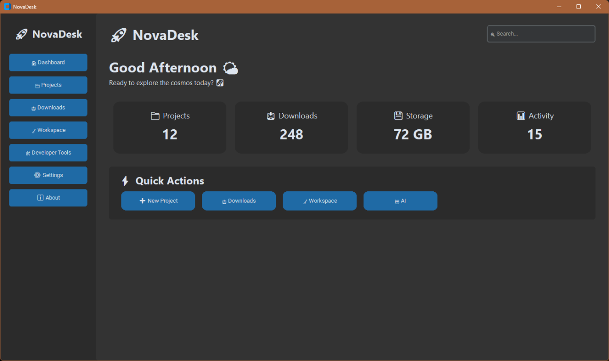
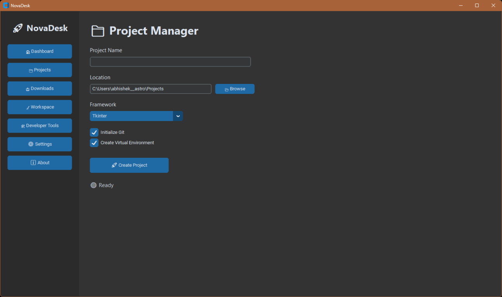
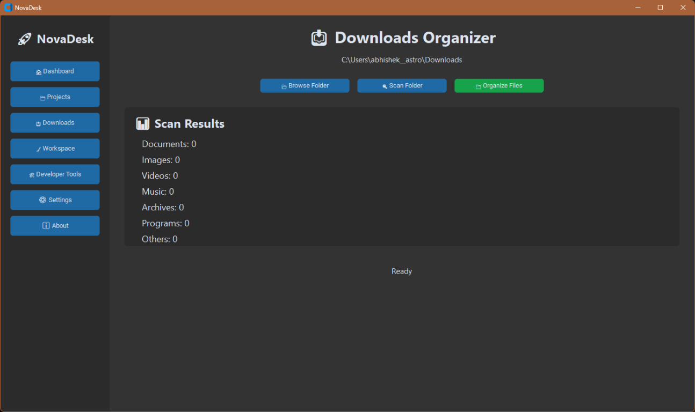
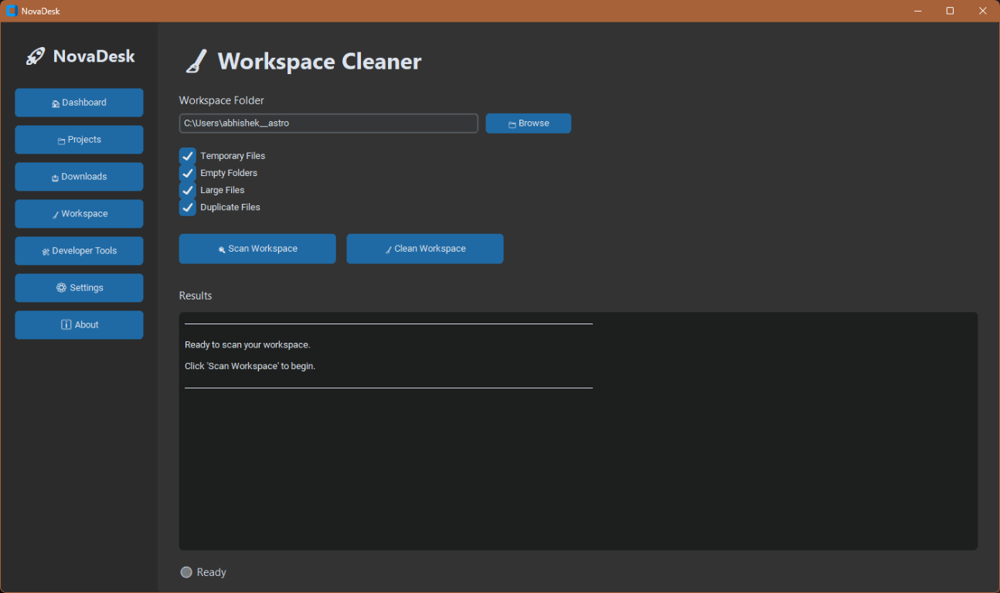
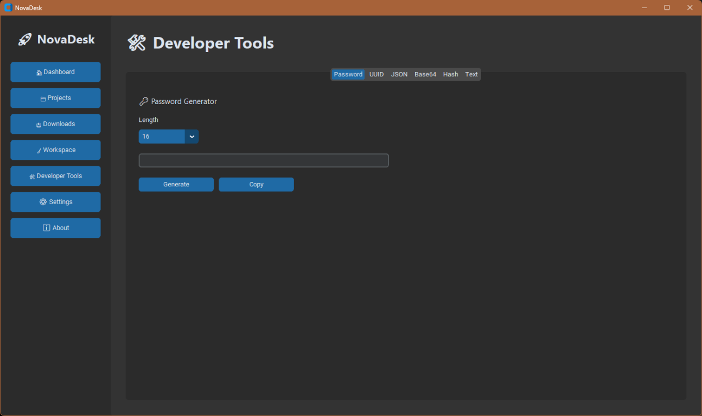
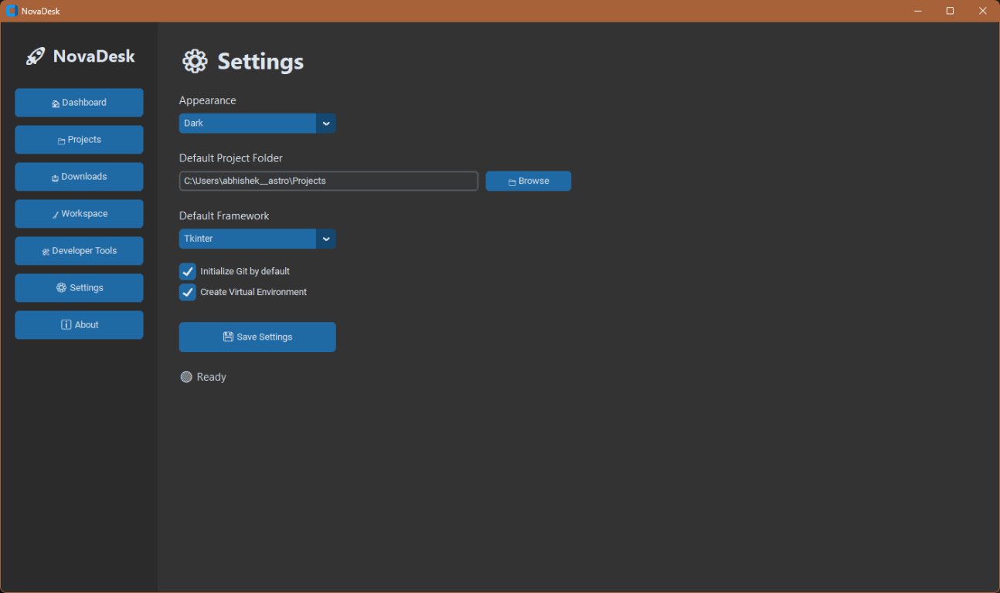
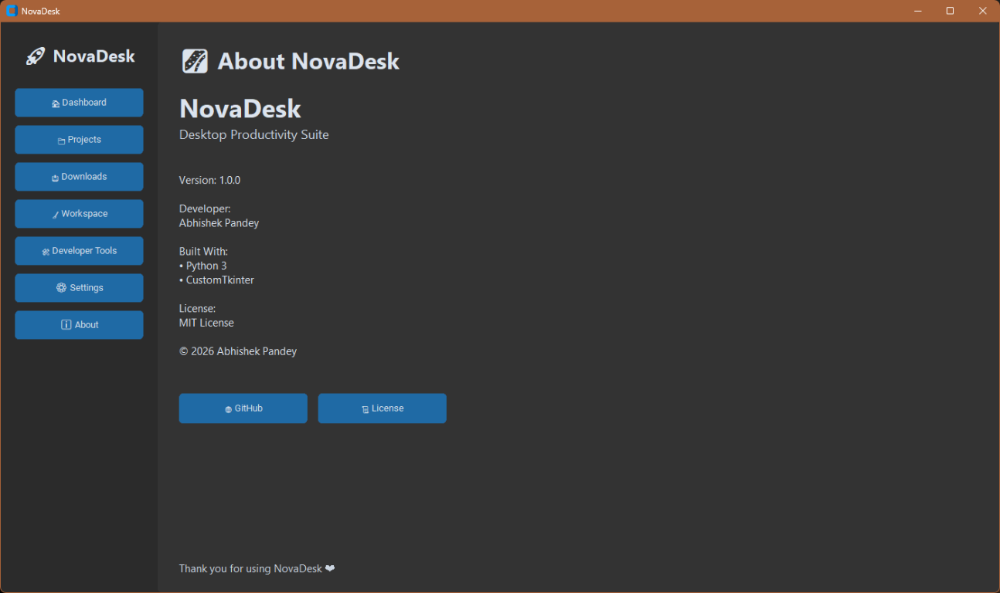

<p align="center">  </p><h1 align="center">NovaDesk</h1><p align="center">Modern Desktop Productivity Suite built with Python & CustomTkinter.</p>

<p align="center">
  
</p>

<p align="center">
A modern desktop productivity suite built with <b>Python</b> and <b>CustomTkinter</b>.
</p>

<p align="center">


</p>

---

# 📖 Overview

NovaDesk is a modern desktop productivity application designed to simplify common development and workspace tasks.

It combines project management, download organization, workspace cleanup, developer utilities, and application settings into one clean and intuitive desktop interface.

---

# ✨ Features

## 📊 Dashboard

- Beautiful modern dashboard
- Quick Actions
- Statistics cards
- Search bar
- Clean dark interface

---

## 📁 Project Manager

Create new projects in seconds.

### Supported Frameworks

- Tkinter
- Flask
- FastAPI

### Features

- Custom project location
- Initialize Git repository
- Create Virtual Environment
- Remember default project folder
- Remember preferred framework

---

## 📥 Downloads Organizer

Organize your Downloads folder automatically.

Supports:

- 📄 Documents
- 🖼 Images
- 🎬 Videos
- 🎵 Music
- 📦 Archives
- 💻 Programs
- 📂 Others

Features:

- Scan Downloads
- Organize Files
- Folder Browser

---

## 🧹 Workspace Cleaner

Analyze and clean your workspace.

Features:

- Temporary Files Detection
- Empty Folder Detection
- Large File Detection
- Duplicate File Detection
- Workspace Statistics

---

## 🛠 Developer Tools

A collection of useful developer utilities.

### 🔑 Password Generator

Generate secure passwords with customizable length.

---

### 🆔 UUID Generator

Generate UUID4 values instantly.

---

### 📄 JSON Formatter

- Pretty Print
- Minify JSON
- Validate JSON

---

### 🔤 Base64 Tool

- Encode
- Decode

---

### 🔐 Hash Generator

Supported Algorithms:

- MD5
- SHA1
- SHA256
- SHA512

---

### 🔠 Text Utilities

Convert text into:

- UPPERCASE
- lowercase
- Title Case
- snake_case
- camelCase

---

## ⚙ Settings

Customize NovaDesk.

Settings include:

- Theme
- Default Project Folder
- Default Framework
- Git Initialization
- Virtual Environment

---

## ℹ About

Displays

- Application Version
- Developer Information
- License
- GitHub Repository

---

# 🖼 Screenshots

## Dashboard


---

## Project Manager



---

## Downloads Organizer



---

## Workspace Cleaner



---

## Developer Tools



---

## Settings



---

## About



---

# 🏗 Project Structure

```text
NovaDesk/
│
├── docs/
│   └── images/
│
├── scripts/
│
├── src/
│   ├── app/
│   ├── cli/
│   ├── config/
│   ├── core/
│   ├── data/
│   ├── services/
│   │   ├── developer_tools/
│   │   ├── downloads/
│   │   ├── project_manager/
│   │   ├── settings/
│   │   └── workspace/
│   │
│   ├── ui/
│   └── utils/
│
├── tests/
│
├── README.md
├── LICENSE
├── pyproject.toml
└── requirements.txt
```

---

# 🚀 Installation

Clone the repository.

```bash
git clone https://github.com/AP6635514/NovaDesk.git
```

Enter the project.

```bash
cd NovaDesk
```

Create a virtual environment.

```bash
python -m venv .venv
```

Activate it.

### Windows

```bash
.venv\Scripts\activate
```

### Linux/macOS

```bash
source .venv/bin/activate
```

Install dependencies.

```bash
pip install -r requirements.txt
```

Run NovaDesk.

```bash
python dev.py run
```

---

# 📦 Build

Create the executable.

```bash
python dev.py build
```

Or using PyInstaller.

```bash
pyinstaller --onefile --windowed src/app/app.py
```

---

# 🧪 Testing

Run all tests.

```bash
python dev.py test
```

---

# 🛣 Roadmap

## Version 1.1

- Disk Usage Analyzer
- Duplicate File Finder
- Better Dashboard Analytics
- More Project Templates
- Improved Workspace Reports

---

## Version 1.2

- Plugin Support
- Command Palette
- Multiple Themes
- Markdown Notes
- Batch Rename Tool
- Image Converter

---

# 🛠 Built With

- Python 3.12+
- CustomTkinter
- Pillow
- PyInstaller
- Git

---

# 👨‍💻 Developer

**Abhishek Pandey**

Student • Python Developer • Astronomy Enthusiast

GitHub:

https://github.com/AP6635514

---

# 🤝 Contributing

Contributions, suggestions, and bug reports are welcome.

If you find an issue, please open one on GitHub.

---

# 📄 License

This project is licensed under the **MIT License**.

See the **LICENSE** file for details.

---

# ⭐ Support

If you found this project useful,

⭐ **Please consider starring the repository.**

It helps the project grow and motivates future development.

---

<p align="center">

Made with ❤️ by <b>Abhishek Pandey</b>

</p>